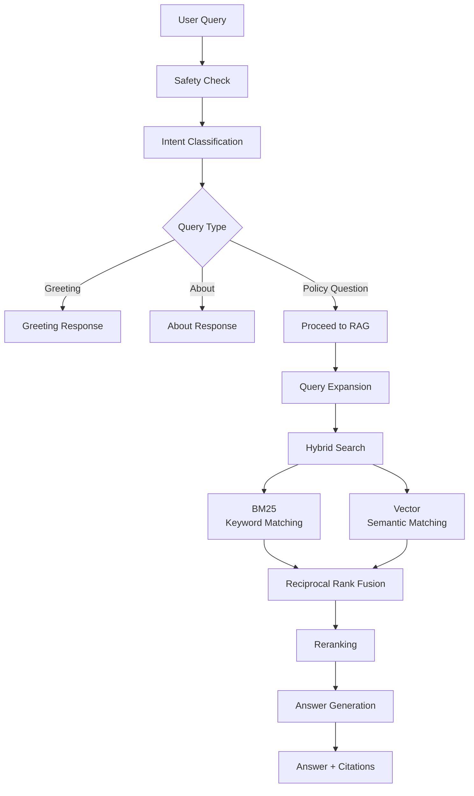

# HR Policy Chatbot

A chatbot built on publicly available HR policy documents from IIMA, CHEMEXCIL, and TCCAP organizations, deployed on Cloud Run (GCP).

## Features
- **Cloud Storage** - Cloudflare R2 integration for scalable document management and parsing
- **Multi-Organization Support** - Query HR policies from IIMA, CHEMEXCIL, and TCCAP
- **Security & Intent Routing** - Detects prompt injection and routes greetings/meta-questions to fixed responses
- **Hybrid Retrieval** - BM25 keyword search + semantic embeddings merged with Reciprocal Rank Fusion, then reranked to provide the LLM with the best possible context
- **Query Expansion** - Auto-generates 3 query variations for improved recall
- **Confidence Scoring** - High/medium/low confidence labels to signal answer reliability
- **Structured Responses** - Every input and output to the LLM follows a proper schema using Pydantic and Instructor

## Prerequisites
- **Python 3.10+**
- **Docker**
- **OpenAI API key** (for embeddings + LLM)
- **LlamaParse API key** (for document parsing)
- **Cloudflare R2** (for cloud document storage)


## Environment Variables
Copy `.env.example` to `.env` and fill in your API keys:
```bash
cp .env.example .env
```

## How It Works
### 1. Document Processing
HR policy documents are stored in the R2 bucket. These documents are downloaded using a pre-signed URL and parsed into Markdown with page mapping. The resulting Markdown documents undergo section-aware chunking with split and overlap when chunk size exceeds the limit. These chunks are used to generate the ChromaDB and BM25 databases.

### 2. Query Pipeline




## Deployment 
### Local Testing with Docker
Before deploying to production, test the app locally with Docker to ensure it responds correctly to different queries.

1. **Build the Docker Image**
```bash
docker build -t hr-policy-rag .   
```

2. **Run the Container**
```bash
docker run -p 8080:8080 --env-file .env hr-policy-rag
```

### Production Deployment (GCP Cloud Run)
- Build the Docker image from the Dockerfile locally before pushing it to Google Container Registry (GCR)
- Deploy the image by running it after configuring the necessary environment variables, memory, min and max instances.

## License
This project uses the **MIT License**. See the `LICENSE` file for details.

